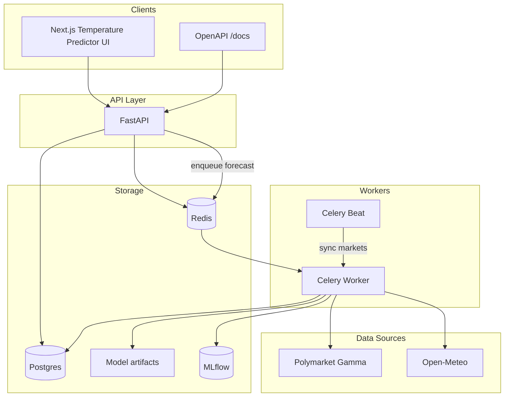
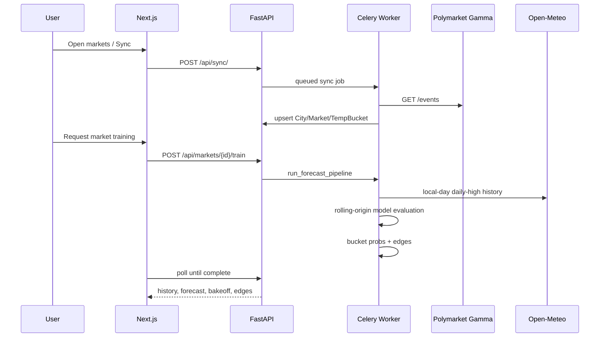

# Temperature Predictor

Polymarket daily **highest-temperature** forecasting. The service discovers active high-temperature markets, evaluates transparent baselines plus ARIMA/SARIMA/Prophet candidates against local-day Open-Meteo history, calibrates bucket probabilities, and records their disagreement with market odds.

No paid price APIs. No Django. No auth.

## Run

```bash
docker compose up --build --watch
```

| Service | URL |
|---|---|
| UI | http://localhost:3000 |
| API + OpenAPI | http://localhost:8000/docs |
| MLflow | http://localhost:5000 |
| Example UI (no ML) | http://localhost:3000/example |

First load: queue **Sync Polymarket**, then explicitly start a market training job and poll its returned job ID.

## Architecture



### Request flow



## Stack

| Layer | Choice |
|---|---|
| API | FastAPI + SQLModel |
| Jobs | Celery + Redis (+ beat) |
| DB | PostgreSQL |
| Tracking | MLflow |
| ML | pmdarima, Prophet, statsmodels |
| UI | Next.js 15 + Chart.js |
| Weather observations | Open-Meteo archive API |
| Markets | Polymarket Gamma |

## What it does

1. **Discover** active highest-temperature markets from Polymarket  
2. **Evaluate** last-value, seasonal-naive, ARIMA, SARIMA, and Prophet models per city  
3. **Predict** the exact target day and calibrate °C/°F bucket probabilities  
4. **Compare** to Polymarket Yes prices; flag \|edge\| ≥ 8%  

## Project layout

```
backend/
  app/           FastAPI, models, routes, Celery tasks
  forecasting/   adapters, trainer, bucket math
frontend/        Next.js UI
docker-compose.yml
```

## API

| Method | Path | Purpose |
|---|---|---|
| GET | `/api/markets/` | List high-temperature markets (`?sort=edge\|volume\|date`) |
| GET | `/api/markets/{id}` | Detail + history + bakeoff + buckets/edges |
| POST | `/api/markets/{id}/train` | Explicitly train/forecast (deduplicated) |
| POST | `/api/markets/{id}/forecast` | Explicitly forecast (deduplicated) |
| GET | `/api/jobs/{id}` | Job status |
| GET | `/api/edges/` | Top disagreements |
| POST | `/api/sync/` | Refresh Polymarket catalog |
| GET | `/health` | Process liveness |
| GET | `/ready` | PostgreSQL/Redis readiness |

## License

MIT — see [LICENSE](LICENSE).
