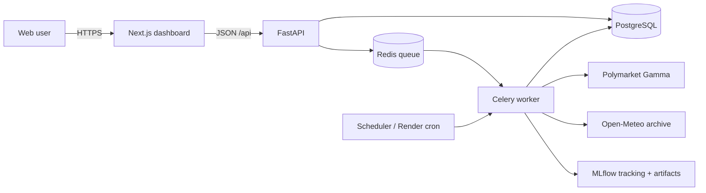

# Temperature Predictor

Temperature Predictor estimates the **daily highest temperature** for active
[Polymarket High Temperature](https://polymarket.com/weather/high-temperature) markets.
It evaluates time-series models against historical local-day observations, refits the selected
model, calibrates market-bucket probabilities, and shows disagreement with current market odds.

The result is an estimate, not a weather-service forecast or financial advice. Public market and
weather ingestion uses keyless Polymarket Gamma and Open-Meteo APIs. Production infrastructure
credentials are provisioned and wired internally by Render.

## Architecture



The API never trains on a read request. Sync and forecast writes return a job ID; the UI polls
`GET /api/jobs/{id}` through queued, fetching, training, evaluating, complete, or failed states.
See [docs/architecture.md](docs/architecture.md) for system, deployment, UML, ER, sequence, and
data-flow diagrams.

## Run locally

Requirements: Docker Engine with Compose v2 and at least 6 GB available memory. No `.env` is
required.

```bash
docker compose up --build
```

| Service | Local URL |
| --- | --- |
| Dashboard | http://localhost:3000 |
| API docs | http://localhost:8000/docs |
| Liveness / readiness | http://localhost:8000/health · http://localhost:8000/ready |
| MLflow | http://localhost:5000 |

The default Compose stack runs production images without source mounts or auto-reload. For explicit
development behavior:

```bash
docker compose -f docker-compose.yml -f docker-compose.dev.yml up --build
```

The development override mounts source, enables FastAPI reload, and runs Next.js development mode.
Copy `.env.example` to `.env` only when overriding defaults.

## Typical workflow

1. Start the stack and wait for `api` and `frontend` to become healthy.
2. Refresh markets in the dashboard, or `POST /api/sync/`.
3. Open a supported market and request a forecast.
4. Follow live job status. On completion, inspect the point forecast, historical RMSE,
   uncertainty guide, calibrated buckets, source metadata, and rolling-origin evaluation.
5. Inspect model runs and artifacts in MLflow.

Production write endpoints require `X-Admin-Token`; they can be disabled by omitting the token.
Scheduled jobs use internal infrastructure and do not expose the token to browsers.

## API

| Method | Path | Purpose |
| --- | --- | --- |
| `GET` | `/api/markets/` | Active high-temperature markets; sort by `date`, `volume`, or `edge` |
| `GET` | `/api/markets/{id}` | Forecast, history, buckets, model comparison, and source metadata |
| `POST` | `/api/sync/` | Queue a deduplicated market sync |
| `POST` | `/api/markets/{id}/forecast` | Queue an explicit forecast |
| `POST` | `/api/markets/{id}/train` | Compatibility forecast/training action |
| `GET` | `/api/jobs/{id}` | Stable job lifecycle and actionable failure text |
| `GET` | `/api/edges/` | Latest model–market probability disagreements |
| `GET` | `/health` | Process liveness |
| `GET` | `/ready` | PostgreSQL and Redis readiness |

Example:

```bash
curl http://localhost:8000/api/markets/?sort=date
curl -X POST http://localhost:8000/api/sync/
curl http://localhost:8000/api/jobs/1
```

## Tests and quality checks

```bash
# Frontend
cd frontend
npm ci
npm run lint
npm run typecheck
npm test
npm run build

# Backend
cd ../backend
python -m venv .venv && . .venv/bin/activate
pip install -r requirements-dev.txt
ruff check app forecasting tests
mypy app forecasting --ignore-missing-imports
pytest
alembic upgrade head

# Containers
cd ..
docker compose config --quiet
docker build --target runtime ./backend
docker build --target runner ./frontend
```

CI runs frontend lint/typecheck/tests/build/audit, backend lint/typecheck/tests/migrations/audit,
and production container builds. Tests mock external APIs; normal checks do not require API keys.

## Configuration

`.env.example` documents every supported local override. Important values:

- `NEXT_PUBLIC_API_URL` is embedded at frontend build time. Local default: `http://localhost:8000`.
- `DATABASE_URL`, `CELERY_BROKER_URL`, and `CELERY_RESULT_BACKEND` are internal Render references.
- `MLFLOW_TRACKING_URI` points workers to MLflow; model artifacts are logged through MLflow.
- `CORS_ORIGINS` is a comma-separated allowlist. Never use `*` with production credentials.
- `ADMIN_TOKEN` protects expensive writes in production.
- task limits, history requirements, backtest folds, forecast horizon, and retention targets are
  independently configurable.

Do not put secrets into `NEXT_PUBLIC_*` variables; they become browser-visible.

## Render deployment

`render.yaml` provisions:

- public Next.js frontend and FastAPI API
- private Celery worker and MLflow service
- Render cron for scheduled sync/training/forecast work
- managed PostgreSQL and Key Value/Redis with internal connection references
- a service-local persistent MLflow disk

Create a Blueprint from the repository and review generated service names before applying it.
Some resources, pre-deploy migrations, workers, cron jobs, and persistent disks require paid Render
plans. Render disks are service-local: API and worker filesystems are not shared. MLflow’s artifact
endpoint and persistent disk are therefore authoritative; `/tmp/model_artifacts` is only transient
worker/API scratch space.

After deployment, run the smoke procedure in [docs/deployment.md](docs/deployment.md).

## Model methodology and limitations

- Input: Open-Meteo archive **observed** daily highs in each city’s local timezone.
- Candidates: last-value and seasonal-naive baselines plus bounded ARIMA/SARIMA/Prophet candidates.
- Selection: horizon-aware rolling-origin backtests ranked by MAE, with RMSE and bias reported.
- Production: selected model refits on validated full history and forecasts the exact target horizon.
- Calibration: out-of-fold errors produce bucket probabilities with tested fallback behavior.

Open-Meteo grid observations do not automatically equal a market’s official resolution station.
Ambiguous markets are marked unsupported. Models do not use weather forecasts, radar, atmospheric
features, breaking-news conditions, or trader information. Backtest error does not guarantee a
future interval, probability calibration can drift, and market prices can become stale.

See [docs/model.md](docs/model.md) and [docs/operations.md](docs/operations.md).

## Repository

```text
backend/                 FastAPI, Celery, persistence, migrations, and forecasting
frontend/                Next.js dashboard, accessible charts, and UI tests
docs/                    Architecture, deployment, model, and operations references
.github/workflows/       CI quality and container validation
docker-compose.yml       Production-like local stack
docker-compose.dev.yml   Explicit development override
render.yaml              Render Blueprint
```

License: MIT. Data attribution: Polymarket Gamma and Open-Meteo.
