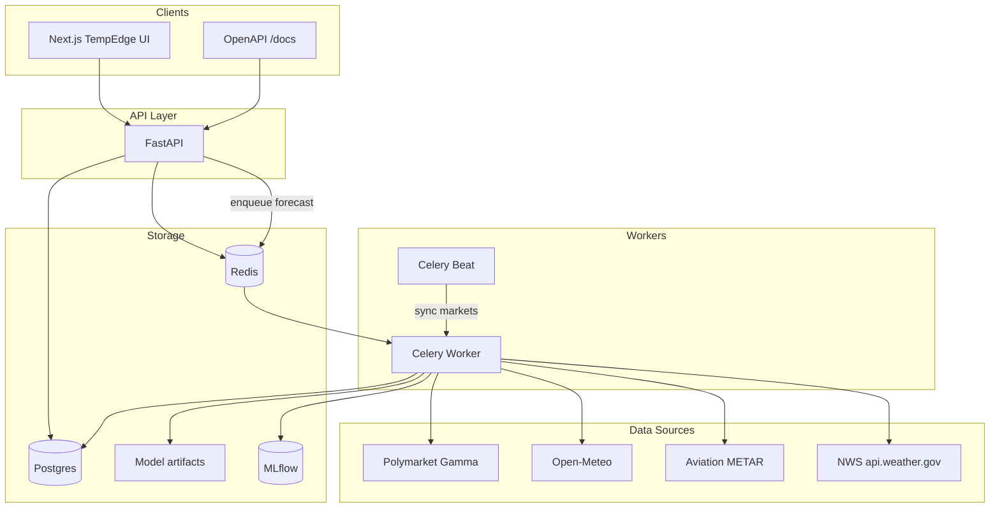
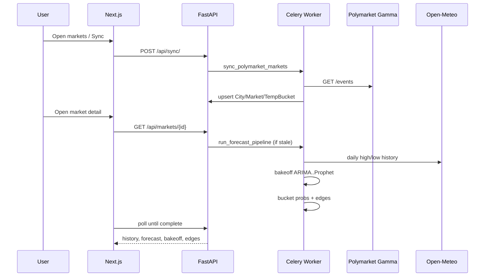

# TempEdge

Polymarket daily **high/low temperature** forecasting. We discover active weather markets from the [Polymarket Gamma API](https://gamma-api.polymarket.com), train an ARIMA-family + Prophet bakeoff on free station history (Open-Meteo / METAR / NWS), turn the best model into bucket probabilities, and surface **edges** vs crowd odds.

No paid price APIs. No Django. No auth.

## Run

```bash
docker compose up --build --watch
```

| Service | URL |
|---|---|
| UI | http://localhost:3000 |
| API + OpenAPI | http://localhost:8000/docs |
| MLflow | http://localhost:5000 |
| Example UI (no ML) | http://localhost:3000/example |

First load: click **Sync Polymarket**, open a market, wait for the Celery job to fetch history and train (~1 min).

## Architecture



### Request flow



## Stack

| Layer | Choice |
|---|---|
| API | FastAPI + SQLModel |
| Jobs | Celery + Redis (+ beat) |
| DB | PostgreSQL |
| Tracking | MLflow |
| ML | pmdarima, Prophet, statsmodels |
| UI | Next.js 15 + Chart.js |
| Weather | Open-Meteo, METAR, NWS |
| Markets | Polymarket Gamma |

## What it does

1. **Discover** all active high/low temp markets from Polymarket  
2. **Bakeoff** ARIMA / SARIMA / ARIMAX / SARIMAX / Prophet per city series  
3. **Predict** target-day temp; map residual RMSE → °C bucket probabilities  
4. **Compare** to Polymarket Yes prices; flag \|edge\| ≥ 8%  

## Project layout

```
backend/
  app/           FastAPI, models, routes, Celery tasks
  forecasting/   adapters, trainer, bucket math
frontend/        Next.js UI
docker-compose.yml
```

## API

| Method | Path | Purpose |
|---|---|---|
| GET | `/api/markets/` | List markets (`?temp_type=&sort=edge\|volume\|date`) |
| GET | `/api/markets/{id}` | Detail + history + bakeoff + buckets/edges |
| POST | `/api/markets/{id}/retrain` | Force train |
| GET | `/api/jobs/{id}` | Job status |
| GET | `/api/edges/` | Top disagreements |
| POST | `/api/sync/` | Refresh Polymarket catalog |

## License

MIT — see [LICENSE](LICENSE).
