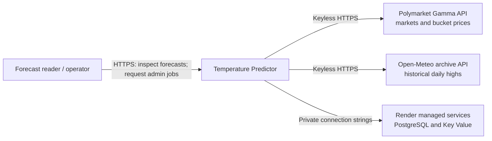
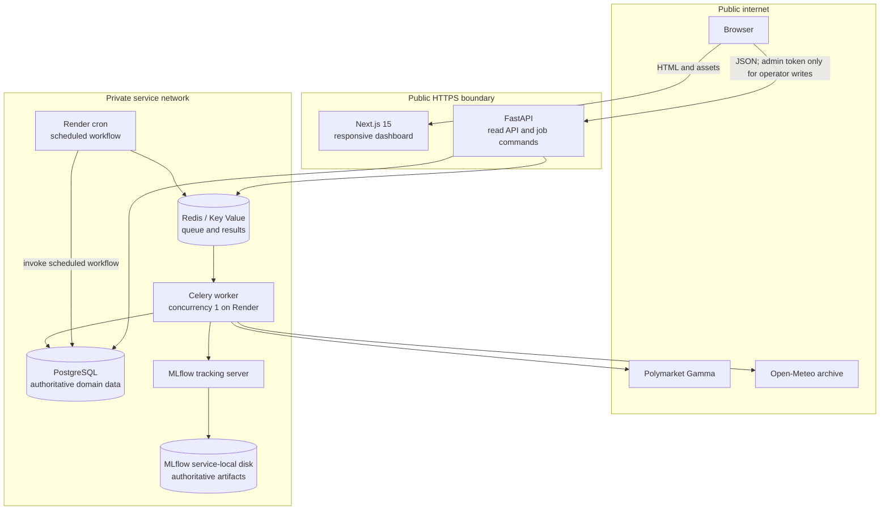
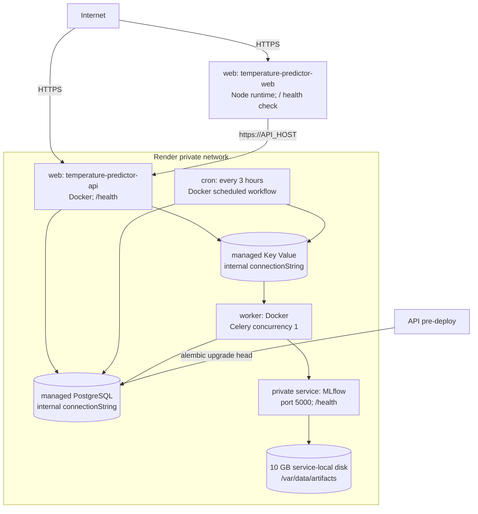
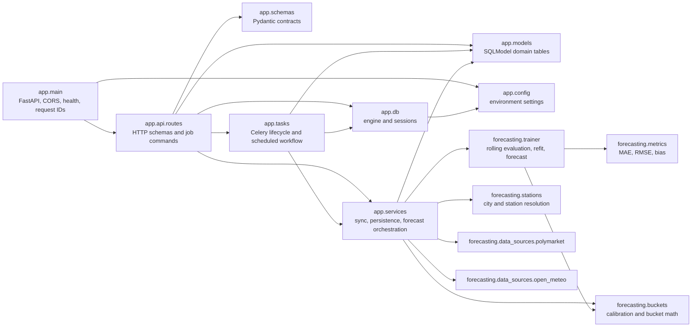
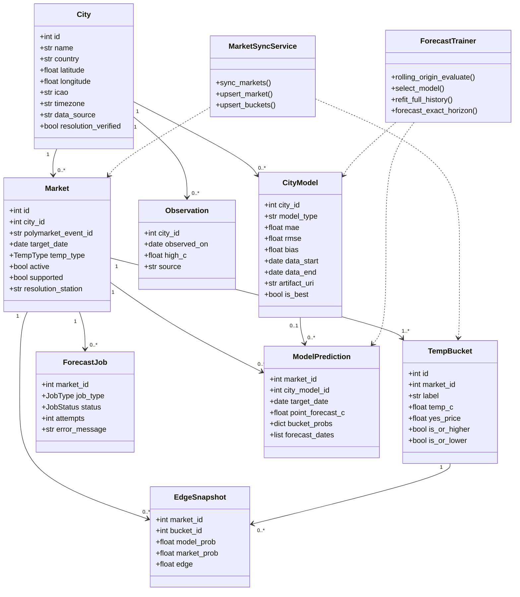
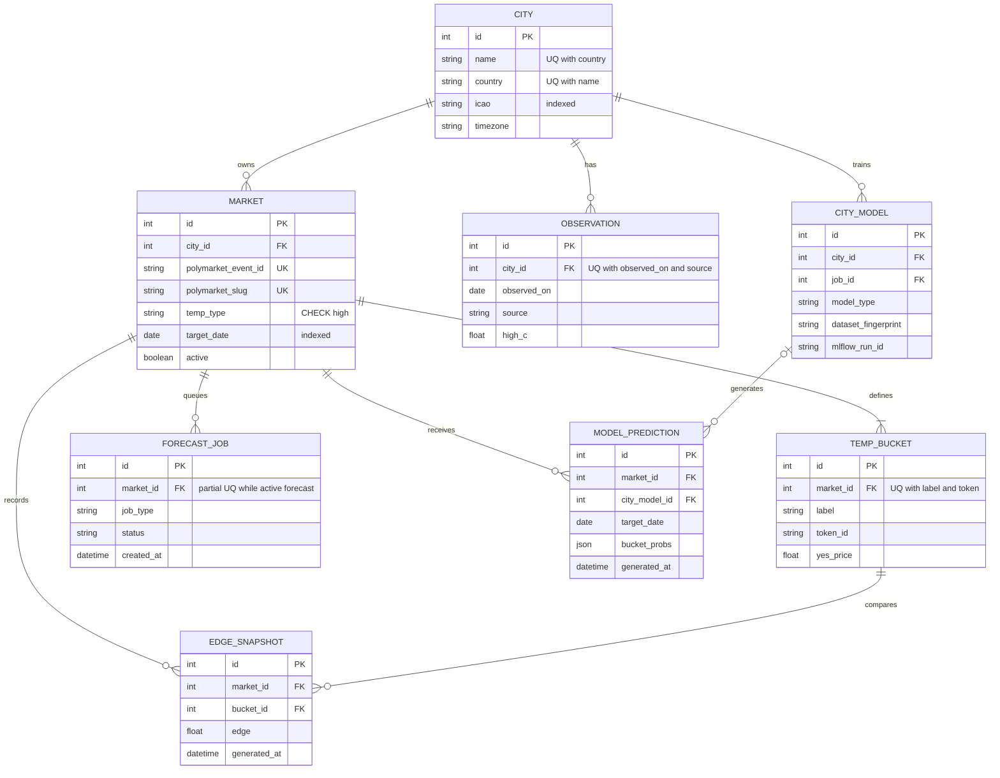

# Architecture

This document describes the implemented Temperature Predictor system. It is high-temperature-only:
Polymarket supplies market definitions and prices; Open-Meteo supplies historical observations,
not weather forecasts.

## System context



## Container and trust-boundary design



The browser uses the build-time `NEXT_PUBLIC_API_URL`. The API and frontend are the only public
services. Reads are unauthenticated. Production sync/training actions require `X-Admin-Token` when
configured; if production has no token, public write actions return `503`.

## Render deployment



The MLflow disk cannot be mounted by API or worker because Render disks are service-local.
Workers upload artifacts through MLflow. The backend’s `/tmp/model_artifacts` path is scratch
storage and is not authoritative. PostgreSQL currently also stores MLflow tracking metadata; the
MLflow disk stores served artifacts.

## Backend package/component design



Dependency direction is from delivery/orchestration toward domain and forecasting utilities.
External adapters do not call API routes.

## UML class view



## Entity relationships and constraints



Important constraints are migration-owned: city `(name, country)`, observation
`(city_id, observed_on, source)`, market event ID and slug, bucket `(market_id, label)`,
nonempty bucket token per market, and one active forecast job per market. Predictions, edges,
jobs, and models are historical records with configurable retention targets; cleanup scheduling
is an operational responsibility.

## Market synchronization sequence

```mermaid
sequenceDiagram
  actor Operator
  participant API as FastAPI
  participant Redis
  participant Worker
  participant Gamma
  participant DB as PostgreSQL

  Operator->>API: POST /api/sync/
  API->>DB: find active sync job
  alt active job exists
    API-->>Operator: existing job_id; deduplicated=true
  else create
    API->>DB: insert queued ForecastJob
    API->>Redis: enqueue sync_polymarket_markets
    API-->>Operator: job_id; queued
    Redis->>Worker: deliver task
    Worker->>DB: status=fetching
    Worker->>Gamma: paginated active high-temperature events
    Gamma-->>Worker: events, buckets, prices, resolution metadata
    Worker->>DB: upsert cities, markets, buckets; deactivate missing markets
    Worker->>DB: status=complete or failed
  end
```

## Scheduled training and forecast sequence

```mermaid
sequenceDiagram
  participant Cron as Render cron / Celery beat
  participant Workflow as scheduled workflow
  participant Gamma
  participant DB as PostgreSQL
  participant Redis
  participant Worker
  participant OM as Open-Meteo
  participant MLflow

  Cron->>Workflow: run_scheduled_workflow
  Workflow->>Gamma: synchronize markets
  Workflow->>DB: select active supported markets
  loop each market without active job
    Workflow->>DB: create queued forecast job
    Workflow->>Redis: enqueue run_forecast_pipeline
  end
  Redis->>Worker: forecast task
  Worker->>OM: local-time historical daily highs
  Worker->>DB: upsert observations; status=training/evaluating
  Worker->>Worker: rolling evaluation, select, full-history refit
  Worker->>MLflow: metrics, lineage, model artifact
  Worker->>DB: CityModel, ModelPrediction, EdgeSnapshot, complete
```

## On-demand retraining sequence

```mermaid
sequenceDiagram
  actor Operator
  participant UI as Next.js
  participant API as FastAPI
  participant DB as PostgreSQL
  participant Redis
  participant Worker

  Operator->>UI: Refresh forecast
  UI->>API: POST /api/markets/{id}/train
  API->>DB: validate supported market; deduplicate active job
  API->>Redis: enqueue when newly created
  API-->>UI: job_id and status
  loop until terminal state
    UI->>API: GET /api/jobs/{job_id}
    API-->>UI: queued/fetching/training/evaluating
  end
  Worker->>DB: persist forecast or failure
  UI->>API: GET /api/markets/{id}
  API-->>UI: refreshed detail
```

## Frontend polling and recovery sequence

```mermaid
sequenceDiagram
  actor User
  participant UI as Responsive UI
  participant API

  User->>UI: request refresh
  UI->>UI: retain content; announce queued state
  UI->>API: POST command
  alt accepted
    API-->>UI: job_id
    loop bounded polling
      UI->>API: GET job
      API-->>UI: stage
      UI->>UI: aria-live stage update
    end
    UI->>API: refetch market
  else disabled or invalid
    API-->>UI: structured error
    UI->>UI: actionable inline error and retry
  end
```

## Forecasting data flow

```mermaid
flowchart LR
  Gamma["Gamma markets<br/>buckets and odds"] --> ValidateMarket["high-only parsing<br/>station support check"]
  OM["Open-Meteo archive<br/>local daily highs"] --> ValidateSeries["units, continuity,<br/>minimum history"]
  ValidateMarket --> Persist["idempotent persistence"]
  ValidateSeries --> Persist
  Persist --> Splits["horizon-aware<br/>rolling-origin folds"]
  Splits --> Candidates["last value · seasonal naive<br/>ARIMA · SARIMA · Prophet"]
  Candidates --> Metrics["MAE ranking<br/>RMSE and bias"]
  Metrics --> Select["quality gate and select"]
  Select --> Refit["refit on full validated history"]
  Refit --> Exact["exact target-date horizon"]
  Splits --> Errors["out-of-fold errors"]
  Errors --> Calibration["empirical calibration<br/>normalized buckets"]
  Exact --> Calibration
  Calibration --> Storage["CityModel · ModelPrediction<br/>EdgeSnapshot · MLflow"]
  Storage --> API["FastAPI contracts"]
  API --> UI["summary · uncertainty · accessible chart<br/>bucket comparison · limitations"]
```



The chart’s shaded guide uses historical RMSE around forecast values. It is explicitly labeled as
an error guide, not a guaranteed confidence interval, and the same forecast values are available in
a text table.

## Codebase tree and ownership

```text
.
├── backend/
│   ├── app/
│   │   ├── api/routes.py       HTTP queries, write authorization, job endpoints
│   │   ├── config.py           environment configuration
│   │   ├── db.py               SQLModel engine and sessions
│   │   ├── main.py             FastAPI app, CORS, request IDs, health/readiness
│   │   ├── models.py           persisted domain entities and constraints
│   │   ├── schemas.py          external API contracts
│   │   ├── services.py         synchronization and forecast orchestration
│   │   └── tasks.py            Celery tasks, retries, scheduled workflow
│   ├── forecasting/
│   │   ├── data_sources/       Polymarket and Open-Meteo adapters
│   │   ├── buckets.py          probability calibration and bucket semantics
│   │   ├── metrics.py          forecast evaluation metrics
│   │   ├── stations.py         city/station resolution
│   │   └── trainer.py          splits, candidates, selection, refit, forecast
│   ├── alembic/                versioned PostgreSQL schema
│   └── tests/                  backend unit/integration tests
├── frontend/
│   ├── public/                 favicon and static assets
│   └── src/
│       ├── app/                dashboard, detail route, metadata, theme
│       ├── components/         chart, tables, header, loading states
│       ├── lib/                API client, contracts, labeled example fixture
│       └── test/               loading/error/success/filter/chart UI tests
├── docs/                       architecture, deployment, model, operations
├── .github/workflows/          CI
├── docker-compose.yml          production-like local orchestration
├── docker-compose.dev.yml      source-mounted development behavior
└── render.yaml                 complete Render Blueprint
```

## API-to-storage trace

| API operation | Route layer | Service/task path | Primary storage effects |
| --- | --- | --- | --- |
| List markets | `list_markets` | read queries | `Market`, `City`, latest `CityModel`, `TempBucket`, `EdgeSnapshot` |
| Market detail | `get_market` | read queries | `Observation`, `ModelPrediction`, `CityModel`, `ForecastJob`, buckets/edges |
| Sync | `trigger_sync` | `sync_polymarket_markets` → `sync_markets` | upsert cities/markets/buckets; deactivate stale markets; update job |
| Forecast | `forecast` / `train` | `run_forecast_pipeline` → `run_forecast_for_market` | observations, model provenance, prediction, immutable edge snapshots, job |
| Job status | `get_job` | read query | `ForecastJob` |
| Disagreements | `list_edges` | read query | latest `EdgeSnapshot` joined to market/bucket/city |

The route module currently performs some joining and sorting directly; services own mutations and
forecast orchestration. This distinction is the contributor ownership boundary, even where query
optimization remains possible.
